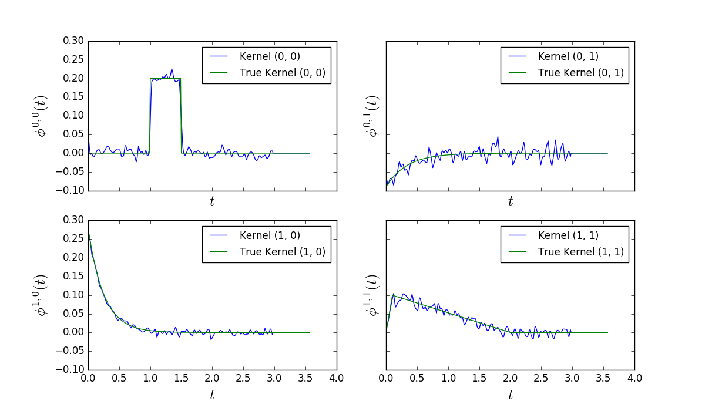

Hawkes non parametric inference with conditional laws
=====================================================

.. contents::
    :depth: 2
    :backlinks: none

.. testsetup:: *

    import numpy as np
    from tick.inference import HawkesConditionalLaw
    from tick.simulation import SimuHawkes, HawkesKernelExp, HawkesKernelPowerLaw

Case of a 2-dimensional Hawkes process with exponential kernels
---------------------------------------------------------------

We simulate a 2-dimensional Hawkes process with exponential kernels

.. testcode:: [exp_kernels]

    h = SimuHawkes(kernels=[[0, HawkesKernelExp(0.1 / 0.2, 0.2)],
                        [HawkesKernelExp(0.1 / 0.2, 0.2), 0]],
           baseline=[0.05, 0.05], verbose=False)
    h.end_time = 1000000
    h.simulate()

Non parametric estimation is two steps.

- First step consists in computing the conditionnal laws
- Second step to solving the Wiener-Hopf equation using quadrature

The first step is obtained by creating an `HawkesConditionalLaw` object from
the `SimuHawkes` object. The Hawkes realization is just given by a list of
np.arrays corresponding to the arrival times of each component

.. testcode:: [exp_kernels]

    e = HawkesConditionalLaw()
    e.fit(h.timestamps)

It's time to solve the Wiener Hopf equation

.. testcode:: [exp_kernels]

    e.compute()

We can have a look at the result:

.. doctest:: [exp_kernels]

    >>> # The exogeneous intensities
    >>> print(e.mu) # doctest: +SKIP
    [0.04942, 0.0495]
    >>> # The matrix of the norms
    >>> e.norm # doctest: +SKIP
    matrix([[ 0.0490553 ,  0.44758089],
            [ 0.53529197, -0.03144761]])
    >>> e.plot() # doctest: +SKIP

.. plot:: z_tutorials/inference/code_samples/hawkes_non_parametric_exp.py

Case of a 2-dimensional Hawkes process with power-law kernels
-------------------------------------------------------------

Remember that a truncated powerlaw kernel has the form

.. math::

    \phi(t) = \alpha (t+\delta)^{-\beta}

The support is computed such that :math:`\phi(support) = error` which by
default is :math:`10^{-5}`.

.. doctest:: [power_law_kernels]

    multiplier = np.array([0.012, 0.008, 0.004, 0.0005])
    cutoff = 0.0005
    exponent = 1.3

    hawkes = SimuHawkes(
        kernels=[[HawkesKernelPowerLaw(multiplier[0], cutoff, exponent, 2000),
                  HawkesKernelPowerLaw(multiplier[1], cutoff, exponent, 2000)],
                 [HawkesKernelPowerLaw(multiplier[2], cutoff, exponent, 2000),
                  HawkesKernelPowerLaw(multiplier[3], cutoff, exponent, 2000)]],
        baseline=[0.05, 0.05], seed=382, verbose=False)
    hawkes.end_time = 50000
    hawkes.simulate()

We now create an `HawkesConditionalLaw` object. It's time to learn about the
options. The main options are about how the conditional laws are sampled.
There are 2 choices

- claw_method = "lin" : (default value)
    the conditional laws are sampled linearly on :math:`[0, h_{max}]` using
    step :math:`h_{delta}`

- claw_method = "log" :
    the conditional laws are sampled using a semi-log sampling :

    - linear on :math:`[0,h_{min}]` using step :math:`h_{delta}`
    - log on :math:`[h_{min},h_{max}]` using step :math:`e^{h_{delta}}`

The semi-log sampling is better for powerlaw kernels

.. doctest:: [power_law_kernels]

    e = HawkesConditionalLaw(claw_method="log",
                             delta_lag=0.1, min_lag=0.002, max_lag=100,
                             quad_method="log",
                             n_quad=50, min_support=0.002, max_support=2000)

Let us point out that we haven't given the HawkesConditionalLaw object a
realization yet. We need to do so (we could have done it at the creation as
in the example above)

.. doctest:: [power_law_kernels]

    # e.incremental_fit(hawkes.timestamps, compute=False)

Then we perform the solving of the Wiener Hopf equation. Let's look at the
options again. It is solved using a quadrature method. You have to choose the
number of quadrature points (`n_quad`). The interval the kernels will be
estimated [`min_support`, `max_support`] and the quadrature method
(you can use either `"log"`, `"lin"` or `"gauss"`).

.. doctest:: [power_law_kernels]

    e.compute()

For displaying powerlaw kernels it is better to use log-log-scales

.. doctest:: [exp_kernels]

    >>> fig = plot_hawkes_kernels(e, log_scale=True, hawkes=hawkes,
    ...                           min_support=0.002) # doctest: +SKIP

.. plot:: z_tutorials/inference/code_samples/hawkes_non_parametric_power_law.py

A case with Time function kernels and negative kernels
------------------------------------------------------

..
   This code takes ~30 seconds to run, hence we do not include it as doctest
   but we rather show it and the figure it generates. Hence it is not guarantee
   to work, and must be checked times to times.

.. literalinclude:: code_samples/hawkes_non_parametric_time_function.py
   :language: python

